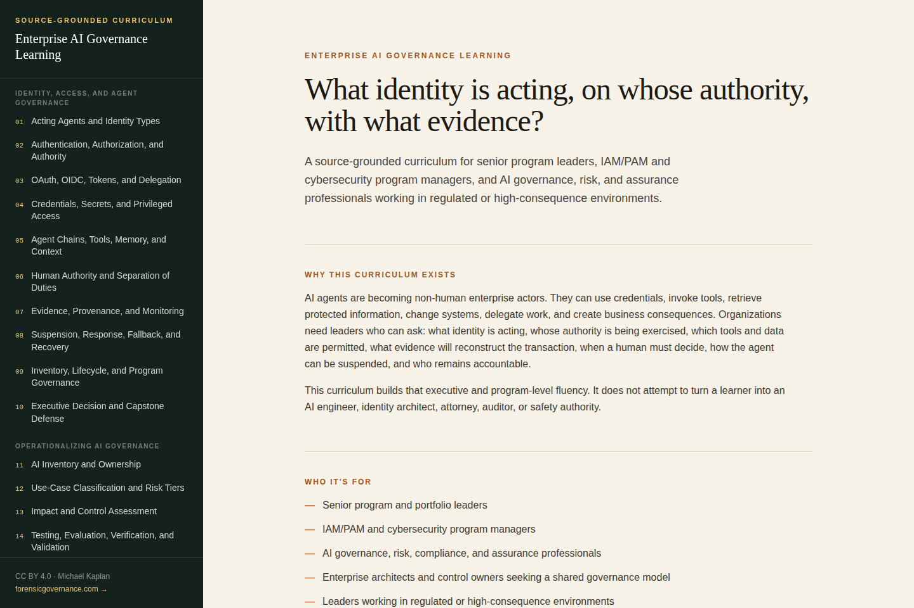

# Enterprise AI Governance Learning

Free, source-grounded learning materials for leaders responsible for AI-agent identity, privileged access, operational governance, and accountable enterprise adoption.

> **Status: in progress, published in stages.** Priority 1 (AI-agent identity, security, and governance) has all ten instructional modules accepted for public learning use — see [Published learning package](#published-learning-package) below. Priority 2 (Operationalizing AI Governance) has begun, with Modules 1–6 (AI Inventory and Ownership; Use-Case Classification and Risk Tiers; Impact and Control Assessment; Testing, Evaluation, Verification, and Validation; Monitoring and Change Governance; Vendor and Supply-Chain Governance) accepted for public learning use; Modules 7–10 remain planned. Priority 3 (Financial Decision Fluency) is planned and not yet built — see [Curriculum roadmap](#curriculum-roadmap). This is not a completed end-to-end curriculum.

## Read the curriculum online

**The easiest way to use this curriculum is the companion website, not this repository's raw files:**

### 👉 [learn.forensicgovernance.com](https://learn.forensicgovernance.com/)

It renders every module's lesson, participant workbook, model answer & review guide, and public release record from this repository's own markdown, with fillable workbook fields (saved automatically in your browser) and a navigable module list — no GitHub folder-clicking required. The source in `site/` builds it directly from whatever is on `main`, so it always reflects the current state of this repository. See [Progress: curriculum now has a live reading website](https://github.com/sentient625/enterprise-ai-governance-learning/issues/30) for more.

## Why this repository exists

AI agents are becoming non-human enterprise actors. They can use credentials, invoke tools, retrieve protected information, change systems, delegate work, and create business consequences.

Organizations therefore need leaders who can ask:

- What identity is acting?
- Whose authority is being exercised?
- Which tools, data, systems, and environments are permitted?
- What evidence will reconstruct the transaction?
- When must a human decide?
- How can the agent and its downstream activity be suspended?
- Who remains accountable?

This curriculum develops that executive and program-level fluency. It does not attempt to turn a learner into an AI engineer, identity architect, attorney, auditor, or safety authority.

## Who it is for

- Senior program and portfolio leaders.
- IAM/PAM and cybersecurity program managers.
- AI governance, risk, compliance, and assurance professionals.
- Enterprise architects and control owners seeking a shared governance model.
- Leaders working in regulated or high-consequence environments.

## Published learning package

All ten Priority 1 modules (AI-agent identity, security, and governance) and six of ten Priority 2 modules (Operationalizing AI Governance) are accepted for public learning use, version 1.0. Each module ships as four documents, read in this order: the lesson, the participant workbook, the model answer and review guide, and the public-release record. Read them at the [companion site](https://learn.forensicgovernance.com/) — the easiest way to work through the curriculum in order — or directly under [`01_AI_AGENT_IDENTITY_GOVERNANCE/`](./01_AI_AGENT_IDENTITY_GOVERNANCE/) and [`02_OPERATIONAL_AI_GOVERNANCE/`](./02_OPERATIONAL_AI_GOVERNANCE/).

Publication of a module does not establish any learner's completion: that requires an original artifact and a defensible explanation. Priority 2's six modules relied on independent web search for source verification rather than a direct publisher-page fetch; each module's public-release record flags that as pending further review. Priority 2 Modules 7–10 and all of Priority 3 remain planned — see the roadmap below.

## Curriculum roadmap

| Priority | Area | Status |
|---|---|---|
| 1 | AI-agent identity, security, and governance | Modules 1–10 accepted; learner completion requires artifacts and defense |
| 2 | Operationalizing AI governance | Modules 1–6 accepted; Modules 7–10 planned |
| 3 | Financial decision fluency | Planned |

The [Learning Roadmap](./00_LEARNING_CONTROL/01_Learning_Roadmap.md) and [Content Build Register](./00_LEARNING_CONTROL/05_Content_Build_Register.md) show the planned sequence and current status.

## Repository structure

| Path | Purpose |
|---|---|
| `00_LEARNING_CONTROL/` | Charter, roadmap, sources, content status, progress, and terminology |
| `01_AI_AGENT_IDENTITY_GOVERNANCE/` | Active curriculum, exercises, and applied artifacts |
| `02_OPERATIONAL_AI_GOVERNANCE/` | Framework-to-operating-model learning |
| `03_FINANCIAL_DECISION_FLUENCY/` | Capital and financial decision learning |
| `04_CASE_STUDIES/` | Cross-domain cases |
| `05_PORTFOLIO_ARTIFACTS/` | Reviewed demonstrations |
| `06_TRAINING_PRODUCTS/` | Future workshop and facilitator materials |
| `site/` | A standalone reading app that renders this curriculum as its own website. See [`site/README.md`](./site/README.md). |

## Evidence standard

Reading alone is not completion. Demonstrated learning requires:

- A completed governing artifact.
- A written or oral defense.
- Source-grounded reasoning.
- Clear ownership and authority boundaries.
- A statement of unresolved uncertainty.
- A distinction between program leadership and qualified technical or professional authority.

## Use boundaries

- The material is educational and illustrative, not production architecture.
- Cases are fictional or sanitized.
- External sources retain their own status, ownership, and terms.
- Drafts, initiatives, project pages, commentary, and final standards are labeled differently.
- Users must verify source versions and applicability to their organization, sector, and jurisdiction.
- Qualified legal, regulatory, accounting, audit, privacy, safety, cybersecurity, architecture, and engineering conclusions belong to the appropriate professionals.

## License

Except where otherwise noted, original educational material is licensed under [CC BY 4.0](./LICENSE.md). You may share and adapt it, including commercially, with attribution.

## Relationship to other work

The curriculum may apply concepts developed in *The Sentient PMO* and *Forensic Capital Governance*, including accountable authority and evidence-based governance. Those books and their manuscripts are separately governed and are not licensed through this repository.

## Author

Michael Kaplan is a senior enterprise program leader whose work connects cybersecurity, IAM/PAM, regulated delivery, AI governance, and accountable decision-making.

